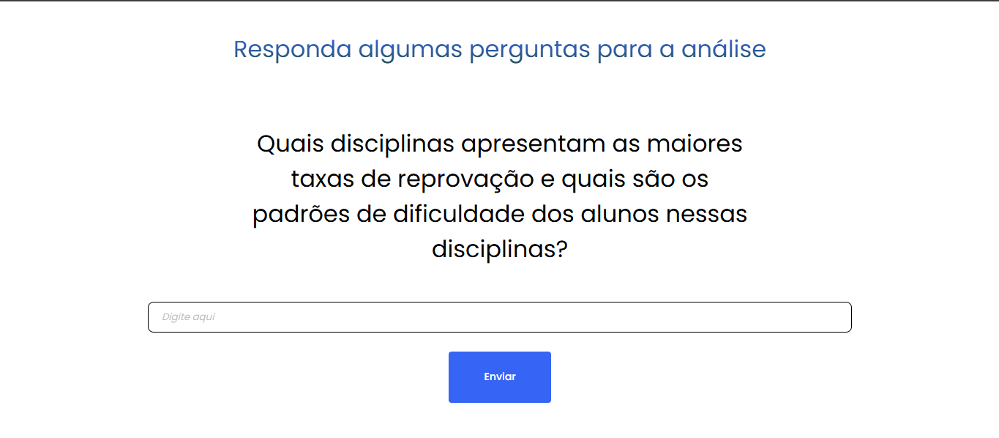

# Insight lab.

## Sistema de Análise de Dados Educacionais com integração da API da Open AI ChatGPT.
Este projeto é um sistema educacional que coleta dados através de perguntas interativas aos usuários e, em seguida, utiliza a API do ChatGPT para gerar análises e insights valiosos para professores e educadores.

### Funcionalidades 
#### Coleta de Dados Interativa: 
O sistema realiza perguntas personalizadas aos usuários para coletar informações relevantes sobre o processo de aprendizado, dificuldades encontradas e outros aspectos relevantes.

#### Integração com ChatGPT: 
Através da API do ChatGPT, o sistema processa os dados coletados e gera análises detalhadas, identificando padrões, tendências e insights relevantes para os professores.

#### Relatórios e Exportação de Dados:
 Os professores podem gerar relatórios personalizados e exportar os dados para análise posterior.

## 📚 Documentação

-[Documentação GitHub](https://github.com/Peumariano/InsightLab)
## Stack utilizada

**Front-end:** HTML, CSS, JavaScript,

**Back-end:** Node.js,

**API do ChatGPT:** Para processamento de linguagem natural e geração de análises.


## Instalação

#### **Pré-requisitos**
 **Node.js** e **npm**

````
Bash

git clone https://github.com/peumariano/insight-lab.git Instale as dependências do backend:

Bash

cd backend npm install # ou pip install -r requirements.txt Configure as variáveis de ambiente:

OPENAI_API_KEY: Sua chave de API do ChatGPT DATABASE_URL: URL de conexão com o banco de dados Outras variáveis de ambiente conforme necessário Instale as dependências do frontend:

Bash

cd ../frontend npm install Configure as variáveis de ambiente do frontend:

URL da API do backend Execução Inicie o backend:

Bash

cd ../backend npm start # 

Bash

cd ../frontend npm start Acesse o sistema no navegador: http://localhost:3000 (ou a porta configurada)
````
### Contribuição
 Contribuições são bem-vindas! Sinta-se à vontade para abrir issues e pull requests para melhorias, correções de bugs e novas funcionalidades.   
## Autores

- [@peumariano](https://www.github.com/peumariano)


## Screenshots



